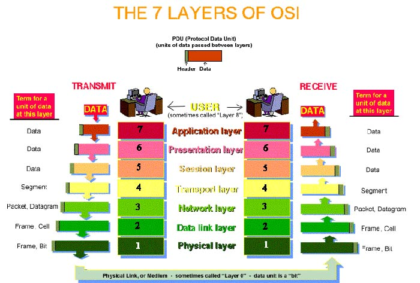

# Lab Networking: Wireshark e Analisi del Traffico

## Obiettivi

- Comprendere il traffico di rete: cattura, analisi.
- Analizzare e manipolare i pacchetti sniffati dalla rete.
- Comprendere nella pratica il funzionamento dello stack ISO/OSI e l'incapsulamento dei dati.

---

## Cosa ci serve

Per l'attività di oggi possiamo utilizzare un ambiente Linux (consigliato) o una macchina virtuale.

Ci servirano i seguenti strumenti:

- Wireshark
- tcpdump
- Python + Scapy + Pyshark

---

## 1. Concetti chiave

- Stack ISO/OSI
  
- Protocolli/Interfacce
  
- Incapsulamento
- Header

---

## 2. Wireshark

Strumento di analisi del traffico di rete, permette di catturare e analizzare i pacchetti che transitano sulla rete.

Usato nel mondo accademico e professionale per

- il troubleshooting networking e software development
- cybersecurity - analisi malware, pentesting, red teaming
- studio protocolli di rete
- analisi forense
- analisi performance di rete
- ...

### Concetti chiave

1. Interfaccia di cattura
2. Aree di lavoro
   2.a Lista pacchetti / Colonne
    2.b Dettagli pacchetto
    2.c Payload
3. Filtri
  3.a Display filter
  3.b Capture filter
4. Statistiche:
  4.a Protocol hierarchy
  4.b Conversations
  4.c Endpoint
5. Analisi dei pacchetti
  5.a esportazione payload
  5.b Ricostruzione flussi

### Attività

### Esercizio 1: Aalizziamo il ping

- Filtra: icmp
- Filtra: dns
- Identifica query e risposta

### Esercizio 2: Analisi traffico HTTP

- Vai su http://neverssl.com
- analisi Header request e response
- Trova metodo GET
- Ricostruisci il flusso TCP

### Esercizio 3: TCP handshake
- Filtro: tcp.flags.syn == 1

