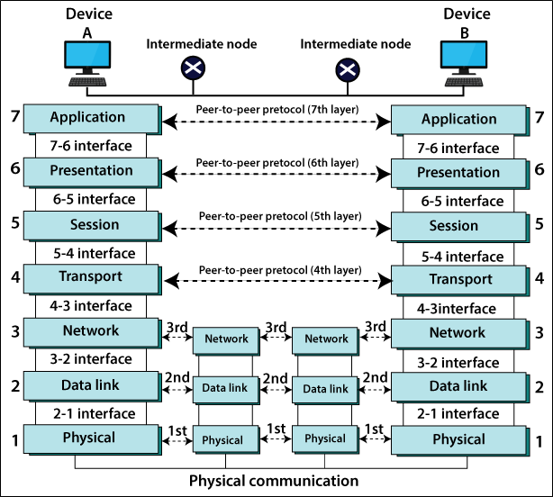
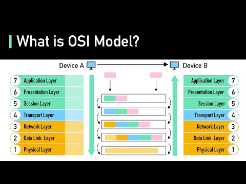
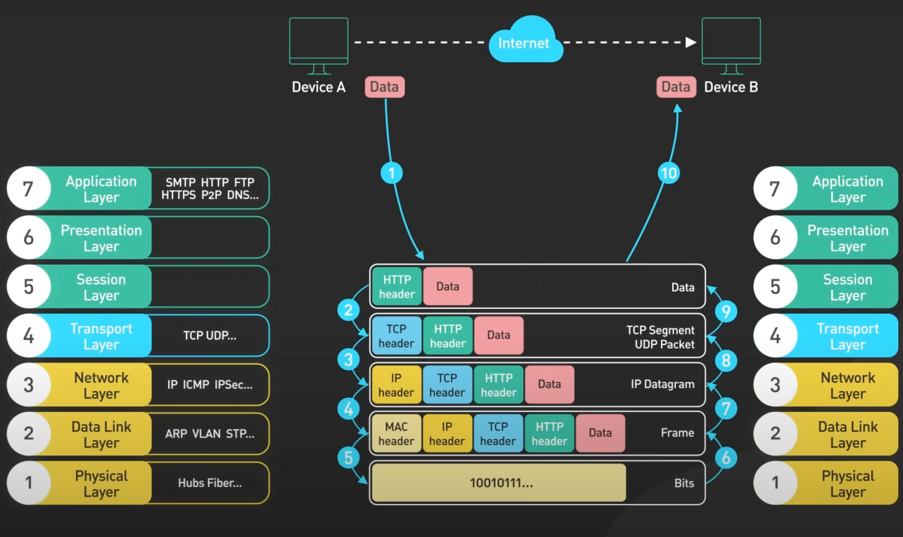

# Lab Networking: Wireshark e Analisi del Traffico

## Obiettivi

- Comprendere il traffico di rete: cattura, analisi.
- Analizzare e manipolare i pacchetti sniffati dalla rete.
- Comprendere nella pratica il funzionamento dello stack ISO/OSI e l'incapsulamento dei dati.

---

## Cosa ci serve

Per l'attività di oggi possiamo utilizzare un ambiente Linux (consigliato) o una macchina virtuale.

Ci servirano i seguenti strumenti:

- Wireshark
- tcpdump
- Python + Scapy + Pyshark

---

## 1. Concetti chiave

- Stack ISO/OSI

  

- Protocolli/Interfacce

  

- Incapsulamento

  

- Header

  

---

